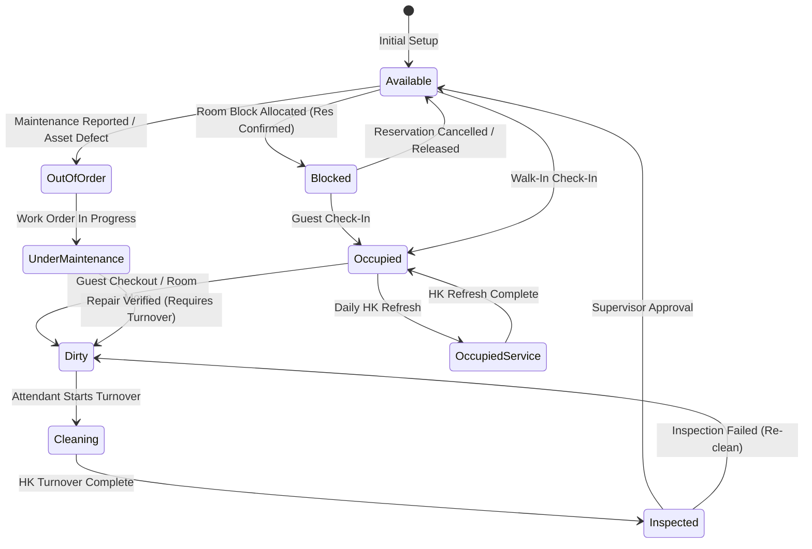

# STAYOS — FINAL ROOM STATE MACHINE SPECIFICATION

**Audit Date:** August 31, 2026  
**Auditor:** Principal Enterprise PMS Architect  
**Implementation Source:** `src/lib/roomMoveEngine.ts`, `src/lib/splitFolio.ts`, `src/app/api/housekeeping/route.ts`, `src/app/api/maintenance/assets/route.ts`

---

## 1. Actual Room Lifecycle State Diagram

---

## 2. State Transition Rules & Side Effects

| From State | To State | Allowed Actor | Permission Required | Trigger | Side Effects & Impacts |
| :--- | :--- | :--- | :--- | :--- | :--- |
| **Available** | **Blocked** | Front Desk / System | `RESERVATION_CREATE` | Reservation confirmation | Allocates date `RoomBlock` in DB |
| **Blocked / Available** | **Occupied** | Front Desk / Guest | `RESERVATION_CHECKIN` | Check-in / Registration | Activates Digital Key, sets folio to In-House |
| **Occupied** | **Dirty** | Front Desk / HK | `RESERVATION_CHECKOUT` | Guest checkout / Room move | Automatically dispatches `HousekeepingTask` (Turnover) |
| **Dirty** | **Cleaning** | Housekeeping | `HOUSEKEEPING_MANAGE` | Attendant begins cleaning | Sets task status to `IN_PROGRESS` |
| **Cleaning** | **Inspected** | Housekeeping | `HOUSEKEEPING_MANAGE` | Attendant submits cleaned room | Creates supervisor inspection queue item |
| **Inspected** | **Available** | HK Supervisor | `HOUSEKEEPING_MANAGE` | Supervisor approval | Marks room ready for check-in |
| **Inspected** | **Dirty** | HK Supervisor | `HOUSEKEEPING_MANAGE` | Inspection rejected | Re-dispatches high-priority turnover task |
| **Any (Vacant)** | **OutOfOrder** | Engineering / HK | `WORK_ORDER_CREATE` | Asset damage / Preventative maint | Blocks all reservation allocations for date range |
| **UnderMaintenance** | **Dirty** | Chief Engineer | `MAINTENANCE_MANAGE` | Work order resolved | Sets room to Dirty so HK cleans construction debris |
